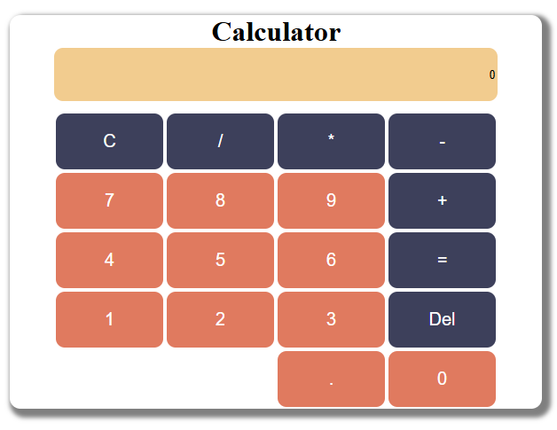

# This is a simple calculator build using HTML, CSS and javascript.

# What did i learned?
    In this project i strengthen the DOM manipulation and even handler knowledge.

    I learned how to update the DOM.

    This was a great project to master DOM.
